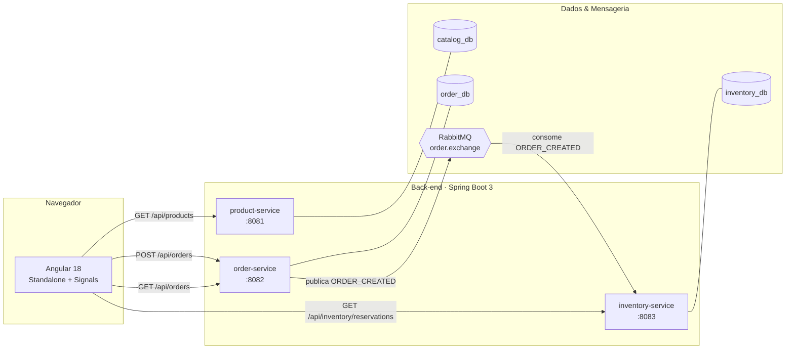

<div align="center">

# E-commerce Microservices

**Sistema de e-commerce distribuído construído para demonstrar arquitetura de microsserviços orientada a eventos**, do back-end Java ao front-end Angular — pensado como peça de portfólio, não como tutorial de CRUD.

[](https://openjdk.org/)
[](https://spring.io/projects/spring-boot)
[](https://angular.dev/)
[](https://www.rabbitmq.com/)
[](https://www.postgresql.org/)
[](https://www.docker.com/)

[Arquitetura](#arquitetura) ·
[Stack](#stack-técnica) ·
[Como rodar](#como-rodar-o-projeto) ·
[Estrutura](#estrutura-do-repositório) ·
[API](#referência-rápida-da-api) ·
[Roadmap](#roadmap)

</div>

---

## Sobre o projeto

A maior parte dos projetos de portfólio de e-commerce é um CRUD com carrinho.
Este aqui tem um objetivo diferente: **tornar visível, na tela, como um
sistema distribuído se comunica de forma assíncrona.**

Um pedido criado no front-end dispara um evento `ORDER_CREATED` publicado no
RabbitMQ pelo `order-service`. Esse evento é consumido, de forma
independente e desacoplada, pelo `inventory-service` — que não tem nenhuma
dependência direta (nem de rede, nem de código) com quem publicou o evento.
O dashboard do front-end mostra esse fluxo acontecendo em tempo real.

> 📸 *Screenshots da vitrine de produtos e do dashboard de eventos aqui.*

## Arquitetura



**Decisões de arquitetura deliberadas:**

- **Banco de dados por serviço** — `catalog_db`, `order_db` e `inventory_db`
  são instâncias Postgres isoladas. Nenhum serviço faz JOIN no banco de
  outro; a única forma de comunicação é via API ou evento.
- **Comunicação assíncrona via RabbitMQ** — o `order-service` publica um
  evento e não sabe (nem se importa) quem vai consumi-lo. Isso permite
  adicionar novos consumidores (ex: um serviço de notificações) sem tocar
  no código do `order-service`.
- **Sem API Gateway (de propósito, nesta fase)** — o front-end fala
  diretamente com as 3 APIs via proxy de desenvolvimento. Essa lacuna é
  intencional e está documentada no roadmap abaixo, junto com o motivo de
  não ter sido resolvida ainda.

## Stack técnica

| Camada | Tecnologias |
|---|---|
| **Back-end** | Java 21 · Spring Boot 3.3 · Spring Data JPA · Spring AMQP · Maven |
| **Front-end** | Angular 18 (Standalone Components + Signals) · TypeScript · Tailwind CSS · Angular CDK |
| **Mensageria** | RabbitMQ (exchange topic + fila dedicada por consumidor) |
| **Persistência** | PostgreSQL 16 (uma instância isolada por microsserviço) |
| **Infraestrutura local** | Docker & Docker Compose |
| **Documentação de API** | springdoc-openapi (Swagger UI) em cada serviço |

## Estrutura do repositório

```
e-commerce/
├── ecommerce-backend/
│   ├── product-service/     # Catálogo — CRUD de produtos
│   ├── order-service/       # Pedidos — publica ORDER_CREATED no RabbitMQ
│   ├── inventory-service/   # Estoque — consome ORDER_CREATED
│   ├── docker-compose.yml   # 3x Postgres + RabbitMQ
│   └── README.md            # detalhes de execução do back-end
└── ecommerce-frontend/
    ├── src/app/
    │   ├── core/             # services, models, interceptors
    │   ├── features/         # vitrine de produtos + dashboard de eventos
    │   └── shared/ui/        # componentes reutilizáveis
    ├── proxy.conf.json       # contorna CORS em desenvolvimento
    └── README.md             # detalhes de execução do front-end
```

Cada pasta (`ecommerce-backend`, `ecommerce-frontend`) tem seu próprio
README com instruções detalhadas — este README raiz é o mapa geral.

## Como rodar o projeto

Pré-requisitos: **Java 21**, **Maven**, **Node.js 18+**, **Docker**.

```bash
git clone https://github.com/TI-nando/e-commerce.git
cd e-commerce
```

**1. Suba a infraestrutura** (3x Postgres + RabbitMQ):

```bash
cd ecommerce-backend
docker compose up -d
```

**2. Rode os 3 microsserviços** (um terminal — ou uma execução na IDE — por serviço):

```bash
cd product-service   && mvn spring-boot:run   # :8081
cd order-service     && mvn spring-boot:run   # :8082
cd inventory-service && mvn spring-boot:run   # :8083
```

**3. Rode o front-end:**

```bash
cd ecommerce-frontend
npm install
npm start   # :4200, já com o proxy configurado
```

**4. Acesse:**

| | URL |
|---|---|
| Aplicação (vitrine + dashboard) | http://localhost:4200 |
| Swagger — Product Service | http://localhost:8081/swagger-ui.html |
| Swagger — Order Service | http://localhost:8082/swagger-ui.html |
| Swagger — Inventory Service | http://localhost:8083/swagger-ui.html |
| RabbitMQ Management | http://localhost:15672 (guest/guest) |

Instruções completas, troubleshooting e explicação de como cada tela
consome a API estão nos READMEs de cada subprojeto.

## Referência rápida da API

| Método | Endpoint | Serviço | Descrição |
|---|---|---|---|
| `GET` | `/api/products` | product-service | Lista produtos |
| `POST` | `/api/products` | product-service | Cria produto |
| `GET` | `/api/orders` | order-service | Lista pedidos |
| `POST` | `/api/orders` | order-service | Cria pedido e publica `ORDER_CREATED` |
| `GET` | `/api/inventory/reservations` | inventory-service | Lista reservas de estoque geradas por evento |

## O que este projeto demonstra

Pensado para quem vai avaliar o código, não só rodar a aplicação:

- Separação real de bounded contexts, com bancos de dados isolados por serviço
- Comunicação assíncrona ponta a ponta (produtor → exchange → fila → consumidor) usando Spring AMQP
- Front-end moderno com Signals do Angular para estado reativo sem RxJS onde não é necessário
- Tratamento de erro centralizado (interceptor HTTP) preparado para indisponibilidade parcial do sistema
- Consciência explícita de trade-offs de arquitetura (ex: ausência de Outbox Pattern, ausência de API Gateway) — documentada, não escondida

## Roadmap

Melhorias conhecidas e deixadas de propósito fora do escopo inicial:

- [ ] API Gateway (Spring Cloud Gateway) na frente dos 3 serviços
- [ ] Service Discovery (Eureka/Consul) em vez de portas fixas
- [ ] Padrão Transactional Outbox no `order-service` (elimina o risco de dual-write com o RabbitMQ)
- [ ] Dead Letter Queue no `inventory-service` para mensagens com falha recorrente
- [ ] Autenticação/autorização (Spring Security + JWT)
- [ ] Testes de integração com Testcontainers (Postgres + RabbitMQ reais)
- [ ] Observabilidade: Micrometer + Prometheus + Grafana, tracing distribuído
- [ ] Pipeline de CI (GitHub Actions) rodando build e testes dos 4 projetos

## Autor

Desenvolvido por [**TI-nando**](https://github.com/TI-nando) como projeto de estudo e portfólio em arquitetura de microsserviços.

## Licença

Este projeto está sob a licença MIT — sinta-se livre para estudar, clonar e adaptar.
